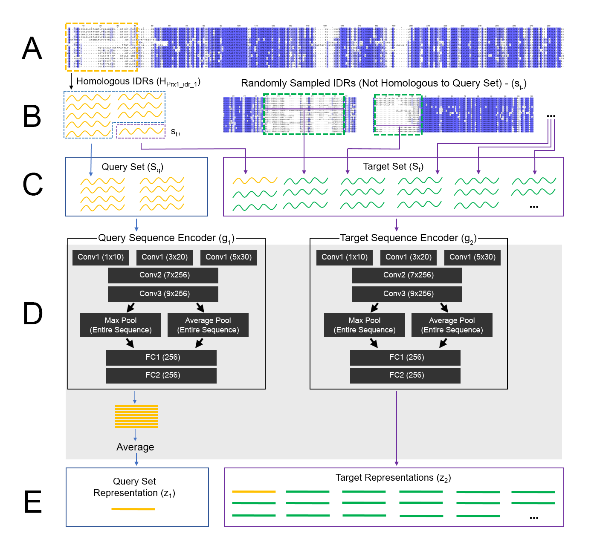

# Reverse Homology

Reverse homology is a self-supervised protein representation learning method that purposes principles in comparative genomics as a learning signal for our models. Given a subset of homologous IDRs (obtained automatically), our model is asked to pick out a held-out homolog from the same family, from a large set of sequences where the other sequences are not homologous. This task, which we call reverse homology, requires our model to learn conserved features of IDRs directly from their sequences, in order to distinguish them from non-homologous background sequences.

A summary of the architecture and training task is shown above. A) At the top, we show the multiple sequence alignment for the yeast protein Prx1 (as an example - during training, we iterate over all IDRs in all proteins) across 15 yeast species. Conserved residues are highlighted in blue. The yellow dotted line box shows the boundaries of an IDR in Prx1. B) By taking IDRs from different species in the yellow dotted box in A, we construct a set of homologous IDRs, H (shown as yellow lines) C) We sample a subset of IDRs (blue dotted box) from H and use this to construct the query set (blue box). We also sample a single IDR (purple dotted box) from Hnot used in the query set and add this to the target set (purple box). Finally, we populate the target set with non-homologous IDRs (green), sampled at random from other IDRs from other proteins in the proteome. D) This panel includes detail s that are more specific to our implementation (highlighted in grey). The query set is encoded by the query set encoder g1. The target set is encoded by the target set encoder g2. In our implementation, we use a five-layer convolutional neural network architecture. We label convolutional layers with the number of kernels x the number of filters in each layer. Fully connected layers are labeled with the number of filters. E) The output of g1 is a single representation for the entire query set. In our implementation, we pool the sequences in the query set using a simple average of their representations. The output of g2 is a representation for each sequence in the target set. The training goal of reverse homology is to learn encoders g1 and g2 that produce a large score between the query set representation and the homologous target representation, but not non-homologous targets. In our implementation, this is the dot product: g1 (Sq) ∙ g2 (st+) > g1(Sq) ∙ g2(st-). After training, we extract features using the target sequence encoder. For this work, we extract the pooled features of the final convolutional layer, as shown by the arrow in D.

# Data Download

We trained two models, one for yeast IDRs, and another for human IDRs. The data used to train these models (and subsequentially extract features and interpretations from) can be found at the Zenodo link here: zenodo.org/record/5146063

# Training and Dataset Loading

Training scripts for the respective models are provided in each folder. 

The opts.py file lets you specify training parameters, as well as where to save the model (checkpoint_path) and where to retrive the data (data_path). 

The dataset_repeat_pad.py file contains a Dataset object that loads fasta files into memory, and preprocesses them into one-hot encoding and batches for neural network training. Some key functions:
<ul>
  <li><b>add_dataset</b>: Loads a directory of fasta files into the dataset object. This should be pointed at the directories of fasta files available at the Zenodo link in Data Download. Note that this function will filter out fasta files with fewer species than the "min_count" variable at object initialization, and remove any alignment symbols "-" from the input sequences (the model trains on un-aligned sequences.)</li>
  <li><b>load_list</b>: Loads input batches for training the neural network. To train the model faster, we use a single contrastive set for all query sequences in a batch: the homologous sequence in the target set for one query sequence become non-homologous sequences for other query sequences. This function will organize it for you given a list of indices of IDRs (inside the object's data container) to include in the query set batch. Note that this model also produces a "mask" vector (which is inputted into the model, but not actually used - this is from previous versions where I was masking out a padding token instead of padding the sequence itself to fill up the entire input, and was used to mask out activations from padded positions, but I never formally depreciated it as versions developed.)</li>
   <li><b>load_sequences_with_length_and_species</b>: Load all sequences for a given homology family as one-hot vectors, along with metadata (length of sequences, and species associated with each sequence. Used for post-training feature extraction.</li>
   <li><b>map_path variable</b>: During object initialization, a "map" file may be specified: this is if the file name itself does not contain the position of the IDR in the protein sequence, as in our yeast data. If the IDR begins at position 1 (i.e. at the N-terminal) it will almost certainly start with an methionine "M" due to the start codon. We found that this is a major shortcut for reverse homology, because it lets the model rule out sequences based on whether they are N-terminal or not, so we remove this M if the IDR is N-terminal. To do this, we need to know if the IDR is N-terminal, so the map file supplies this information.</li>
</ul> 

The model_scaled_final.py file contains the architecture, as shown in the above figure. Some implementation details:
<ul> 
  <li>Since we use a single target set for a batch of query sequences, the batch sizes for the query and target sequence inputs into the model are uneven. Unfortunately, Keras does not permit this natively, so to get around this behavior, the inputs are encoded as a single batch of batches, and then the first dimension of size 1 is removed before the model proceeds.</li>
  <li>The target and query sequences are inputted as 2D matrix, with the amino acids of the sequences being one axis and the number of sequences being the other axis. We implement the convolutional filters as 2D convolutions, but set the width of the kernel along the species axis to 1 (so the kernel only scans a single sequence at a time.)</li>
</ul>

The train.py file includes the training loop. We have modified versions of some losses and metrics to adjust for the fact that our inputs have an additional dimension tacked on at the start to standardize the batch sizes: these are identical to the native Keras losses/metrics except to handle this additional dimension. 

# Feature Extraction

Scripts for extracting features from trained models are included in the "feature_extraction" folder. For the yeast model, we provide scripts to extract features from the final fully connected and convolutional target encoder layers. For the human model, we provide scripts to extract features from the final convolutional target encoder layer. Line 41 (model.load_weights) should point to the weights path of the model you want to extract features from, while datapath is the directory of fasta files (supplied as a glob regular expression) to extract features from. Outfile is the directory to output features into. 

# Visualization

Scripts for generating sequence logos and mutational scanning heat/letter maps from trained models are included in the "visualization" folders. 

To generate the sequence logos visualizing each feature in a model, use the "create_average_sequence_logos.py" and "create_max_sequence_logos.py" code. The "datapath" variable in these scripts need to be pointed at the directory of IDR fasta files. Line 47 can be changed to point at the location of the pre-trained weights of the model you want to visualize features for. Finally, outdir can be changed to point to the directory to output sequence logos into. This script will do two passes over the data: once to store the maximum feature activation for each feature, and the second to create PFMs using sequences that reach at least 70% of that activation (or as specified using the "percent_filter" variable.)

To generate the mutational scanning heat maps use "mut_scanning_heat_maps.py" and letter maps use "mut_scanning_letter_maps.py". The IDRs to generate maps for can be specified with the "idrs_of_interest" variable, which accepts a list of strings. Model to use is specified as "weight_path", and outdir specifies the output directory (a subdirectory will be saved for each IDR.) Note that a file of the z-scores for each feature across all IDRs needs to be specified (variable: z_score_file), so the script can automatically retrieve the most significant features for each IDR: these are available in the Zenodo link under Data Download. The script can either be set to automatically select the most important features (autoselect = True) or if set to false, specific features (supplied as a list of ints to filters_of_interest). 

# To-dos

We hope the ability to make specific mutagenesis predictions for IDRs is of interest to biologists, but realize this code is not easily accessible for this purpose - we have a web application in the works, but in the meantime, if you have any challenges working with the code, please reach out.
